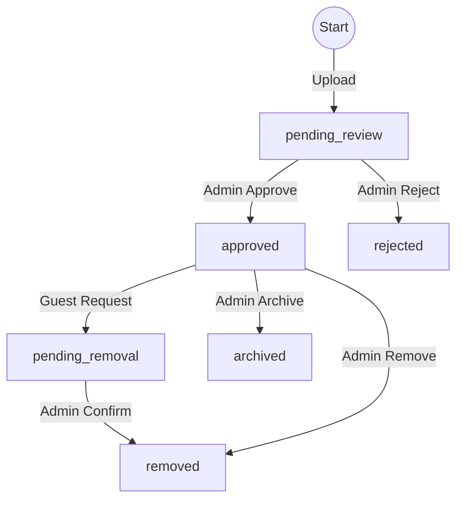

# Video Lifecycle

This document defines the strict state machine for video content on HIFLIX.

## Video States

| State | Description | Visibility | Set By |
| :--- | :--- | :--- | :--- |
| `draft` | Video metadata created, upload in progress or interrupted. | Uploader & Admin | Admin / System |
| `pending_review` | Upload complete. Awaiting Admin approval. | Uploader & Admin | Guest (on upload) |
| `approved` | Reviewed and accepted. Live on the platform. | **Public** | Admin |
| `rejected` | Reviewed and denied. Not visible to public. | Uploader & Admin | Admin |
| `pending_removal` | Uploader requested deletion. | Uploader & Admin | Guest |
| `removed` | Removed from platform (Soft Delete). | Admin Only | Admin |
| `archived` | No longer active, kept for history. | Admin Only | Admin |

## State Transitions

### 1. Upload Flow (Guest)
- **Start**: User initiates upload.
- **State**: `draft` (optional intermediate) -> `pending_review` (final success).
- **Rule**: Guests CANNOT set status to `approved`.

### 2. Approval Flow (Admin)
- **Input**: Video in `pending_review`.
- **Action**: Admin reviews content.
- **Outcome A**: Admin sets `approved`. Video becomes Public.
- **Outcome B**: Admin sets `rejected`. Reason logged. Video hides.

### 3. Removal Flow (Guest Initiated)
- **Input**: Video in `approved` or `pending_review`.
- **Action**: Guest clicks "Remove".
- **Transition**: `approved` -> `pending_removal`.
- **Final**: Admin sees request -> sets `removed`.

### 4. Administrative Action
- Admin can force transition from ANY state to `removed` or `archived`.
- Admin can force transition from `rejected` -> `approved` (Change of mind).

## Diagram

